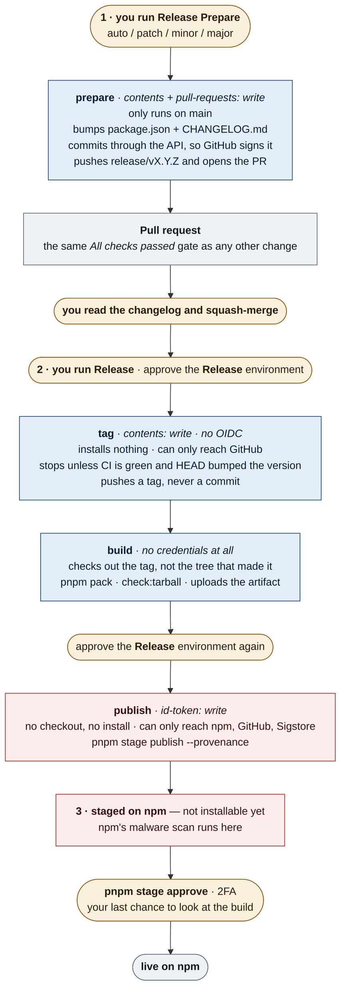

# Release

Releasing takes two clicks in the Actions tab, a pull request in between, and one approval from
your laptop.

Everything happens in CI. There is no release script to run locally and no npm token stored
anywhere — publishing signs in with OIDC, which only a job running from `main` in the `Release`
environment can do.

## Cut a release

1. **Actions → Release Prepare → Run workflow.** Pick the bump, or leave `auto` to work it out
   from the commit messages since the last tag.

   It bumps `package.json`, writes `CHANGELOG.md` and opens a pull request. Scoped commits land under
   `#### Scope` sub-lists in each section (`scripts/changelog-postprocess.mjs`); a scope's
   display name — `ci` → `CI` — is set in `changelog.scopeMap` in `package.json`.

2. **Read that pull request, then squash-merge it.** Its body is the changelog the GitHub Release
   will carry. `CI` waits for **Approve and run** first: the pull request is authored by
   `github-actions[bot]`, which the *Require approval for all external contributors* policy treats
   like any outside contributor. After that, wait for it like any other PR.

3. **Actions → Release → Run workflow.** It tags the merged commit, builds the tarball and sends
   it to npm.

   It stops before writing anything if `CI` on that commit isn't green, or if `HEAD` isn't the
   release commit.

4. **Approve the `Release` environment twice.** Once before the tag is written, once before
   anything reaches npm.

5. **Approve the package on npm.** Until you do, the version is *staged*: it exists, but nobody
   can install it.

   ```sh
   pnpm stage list nuxt-convex-module   # find the stage id
   pnpm stage view <stage-id>           # look at what CI actually built
   pnpm stage approve <stage-id>        # 2FA — this is what makes it live
   ```

6. **Check that it shipped with provenance.**

   ```sh
   npm view nuxt-convex-module@<version> dist   # lists `attestations`, not just `signatures`
   gh release verify v<version>
   ```

## What runs



Amber is you. Blue is a job that can write something. Red is the part that can reach npm. The run
stops and waits for a person five times: two dispatches, the merge, the second approval, and the
2FA approval on npm.

## Rehearse first

Tick **dry-run** on **Release**. Everything runs except the writes: `build` packs and checks
`main` as it is, and `publish` does the real OIDC handshake with npm and then stops.

That proves the npm Trusted Publisher still trusts us — repository, workflow filename and
environment all have to match — and fails if it doesn't. Do a dry run after every change to
`release.yml`.

A rehearsal also works on an ordinary `main`: the "HEAD must be the release commit" check drops to
a warning in a dry run.

## Version numbers

With `release-type: auto`, the bump comes from the
[Conventional Commits](https://www.conventionalcommits.org/) since the last tag:

| Commit type                          | Release |
| ------------------------------------ | ------- |
| `fix:`                               | patch   |
| `feat:`                              | minor   |
| `feat!:` / `BREAKING CHANGE:` footer | major   |

`chore:`, `docs:`, `refactor:`, `test:`, `ci:`, `build:` and `perf:` show up in the changelog but
don't move the version.

Below `1.0.0` changelogen steps everything down once: a `feat` gives a patch, a breaking change
gives a minor. Pick `patch` / `minor` / `major` explicitly to override.

## If something goes wrong

**The tag was pushed but publishing failed.** npm has nothing. Check
`pnpm stage list nuxt-convex-module` first — the first attempt may have staged after all. If not,
either re-run the failed jobs (`gh run rerun <run-id> --failed`, the tarball artifact lives one
day) or run **Release** again with `re-stage: vX.Y.Z`, which skips straight to staging that tag.

`re-stage` also creates the GitHub Release if it is missing, and leaves it alone if it is not — so
the narrower case where the tag landed and the Release step then failed repairs itself too. Its
notes come from the tag, not from whatever `main` says by then.

**`CI` is red, or `HEAD` isn't the release commit.** The run refuses before writing anything.
Nothing to undo.

**You staged it and then rejected it.** That version number is spent, because the tag can't be
moved. Release the next patch instead.

**"tag already exists" when pushing.** That version is already out. You dispatched twice. The
guard is deliberate — don't re-run past it. `re-stage: vX.Y.Z` is the way back in.

**The release PR was merged but never tagged.** Run **Release** while that commit is still `HEAD`
on `main`. If something else merged in the meantime it will refuse — prepare a fresh release
rather than tagging the wrong commit.

## Why it's built this way

### The release commit is a normal pull request

It's the one commit that decides what everyone installs. It used to be pushed straight to `main`
by the release job, which made it the only commit here that never went through a PR or its checks.
Now `Release Prepare` opens a PR, so you read the changelog before it's published and the commit
passes the same gate as everything else.

This is also what makes `main` protectable. A rule requiring pull requests would have blocked the
old release job's push. Nothing in the release writes to `main` any more — `prepare` pushes to
`release/vX.Y.Z`, `Release` pushes only a tag — so the rule needs no exception for a bot.

Two things follow from the split, and both are enforced in `release.yml`:

- **`Release` never bumps the version.** It reads it from the merged `package.json`. Running
  `changelogen --release` in both halves would bump twice and tag `v0.1.1` for a `0.1.0` release.
- **`Release` refuses a `HEAD` that didn't change the version.** Otherwise an ordinary PR merging
  between the release PR and the dispatch takes the tag instead, and nothing downstream notices:
  `build` compares the tag to `package.json`, which is unchanged, so it still passes.

### Credentials never sit next to dependency code

| Job | Holds | Runs |
| --- | --- | --- |
| `tag` | `contents: write` — no OIDC, no install | one `git tag`, then `gh release create` |
| `build` | nothing | the build, from a clean checkout of the tag |
| `publish` | `id-token: write` — no checkout, no install | one pinned pnpm on one tarball |

Neither job holding a credential installs anything.

`tag` is the only one that can write to the repository, and it writes exactly one thing: a tag, on
a commit that's already merged and already green. It uses the `git`, `jq` and `gh` from the runner
image, and reads the release notes out of the `CHANGELOG.md` the commit already carries. So no
dependency code runs beside the write token, and the job can only reach GitHub.

`build` runs the dependency code, with nothing worth stealing nearby. `publish` holds the only
credential that can reach npm, runs nothing but pnpm on a tarball, and can only reach npm, GitHub
and Sigstore.

### One environment, two approvals

`Release` — required reviewer, `main` only — guards both jobs that can do damage. GitHub checks
environment rules per job, so it asks twice: before `tag` writes anything, and after the build,
before `publish` reaches npm. The second prompt is the last cheap place to stop a bad build.

The npm Trusted Publisher is bound to that same environment. npm accepts a token only from a job
that ran in `Release`, and a job can only run in `Release` from `main` — so a `release.yml` edited
on a branch can neither write to the repository nor reach npm.

### Staging is the only check on what's *inside* the build

npm holds the release in a queue and runs its malware scan there. It becomes installable only
after you approve it with 2FA.

This is the one control that can stop a poisoned build. Provenance proves where a package came
from, not what's in it.

## Repository rules

The rules that protect `main` and the tags are committed under
[`.github/rulesets/`](./.github/rulesets/), so they can be reviewed like anything else.
`weekly.yml`'s `rulesets` job fails if the live rules stop matching the files.

| Control | What it guarantees |
| --- | --- |
| `Release` environment | Required reviewer, `main` only. This is what npm trusts. |
| `main-guard` ruleset | `main` can't be deleted or force-pushed. History can be added to, never rewritten. |
| `main-pr-gate` ruleset | `main` takes pull requests only, requires `All checks passed`, and requires signed commits. That last one is why `Release Prepare` commits through GitHub's API instead of `git commit` — a commit made on a runner is unverified, and a rebase merge would carry it onto `main` as-is. |
| `tag-guard` ruleset | `v*` tags can't be deleted, moved or force-updated. Release history stays pinned to its commit. |
| Immutable releases | The Release that `tag` creates locks its tag and carries an attestation: `gh release verify vX.Y.Z`. |
| `sha_pinning_required` | GitHub itself refuses a workflow that references a floating action tag, not just zizmor. |
| Secret scanning + push protection, Dependabot alerts and security updates | On. |

**Why the release still works under all of that.** `GITHUB_TOKEN` can't bypass a ruleset — the
bypass list only accepts repository roles, teams, GitHub Apps, org admins and Dependabot, and
Actions is none of them. That used to be the problem: requiring pull requests or signatures on
`main` would have blocked the release job's own push, and the way around it would have been a
GitHub App key or a PAT stored as a secret. That's exactly the long-lived credential this design
exists to avoid.

Splitting the release removed the problem instead of working around it. `prepare` pushes a branch,
`Release` pushes a tag, neither touches `main`. There is one rule deliberately missing: tag
`creation`, because it would stop CI tagging at all. `tag-guard` freezes tags once they exist
instead.

## Dependencies

Updates are handled by [Dependabot](./.github/dependabot.yml): npm versions, GitHub Actions digest
bumps (keeping the `@<sha> # vX.Y.Z` convention), and CVE security updates. No third-party app has
write access to the repo.

- **Mondays, grouped.** Non-major npm updates come as one PR, Actions bumps as another. Dependabot
  doesn't group majors; run `pnpm bump` for those (`taze major -w`).
- **The cooldown is one day wider than pnpm's.** Dependabot waits 2 days, pnpm's
  `minimumReleaseAge` is 24 h (`pnpm-workspace.yaml`). That way Dependabot never proposes a
  version pnpm will refuse to install. Security updates skip the wait on purpose.
- **Keep the two exclude lists in sync.** `cooldown.exclude` in `.github/dependabot.yml` and
  `minimumReleaseAgeExclude` in `pnpm-workspace.yaml` list the same first-party Nuxt/Convex
  packages. If they drift apart, Dependabot proposes versions pnpm won't install.
- **Every PR's dependency changes are inspected.** CI's `dependency-review` job fails a PR that
  pulls in a known CVE (moderate or higher) or a package GitHub has flagged as malicious. pnpm's
  cooldown only delays a new version; it never looks inside it.
- **The whole lockfile is rescanned weekly.** `dependency-review` only sees what a PR changes, so
  [weekly.yml](./.github/workflows/weekly.yml)'s `osv` job scans the committed lockfile on a
  schedule. That, plus Dependabot's own alerts, is what catches a CVE filed against a dependency
  that stopped changing.

## Checks that don't run on commits

Everything on a schedule lives in [weekly.yml](./.github/workflows/weekly.yml). None of it can
block a merge — a scheduled check that fails a pull request blames whoever happened to open it.
These jobs are there to catch things changing outside the repository:

| Job | What it watches |
| --- | --- |
| `scorecard` | the repo's own settings — pinned actions, permissions, rulesets |
| `osv` | the committed lockfile, against the OSV database |
| `rulesets` | the live branch and tag rules, against the files in `.github/rulesets/` |
| `links` | dead links in the docs, README and policy files |
| `report` | the other four — it opens or comments on a `ci: weekly drift` issue when one fails |

`report` exists because a failed scheduled run only emails whoever last edited the cron. That's
the wrong person soon enough, and nobody at all once the mail gets filtered.

Two more checks live outside this repo's workflow files:

- **CodeQL** runs from GitHub's default setup (Settings → Code security), on the `extended` query
  suite over `javascript-typescript` and `actions`.
- **`CI`'s `static` job** runs [zizmor](https://docs.zizmor.sh) over the workflows for security
  problems and [actionlint](https://github.com/rhysd/actionlint) for correctness. Accepted
  findings are listed in [.github/zizmor.yml](./.github/zizmor.yml) and
  [.github/actionlint.yaml](./.github/actionlint.yaml).

## One-time setup

npm only lets you configure Trusted Publishing after a package exists, so `v0.0.0` was published
by hand first.

1. **Set up the trusted publisher** at
   <https://www.npmjs.com/package/nuxt-convex-module/access> → **Trusted Publisher** →
   *GitHub Actions*:

   | Field               | Value                 |
   | ------------------- | --------------------- |
   | Organization / user | `qruto`               |
   | Repository          | `nuxt-convex-module`  |
   | Workflow filename   | `release.yml`         |
   | Environment         | `Release`             |

   Leave it **stage-only** (the default). Turn on **Require two-factor authentication and disallow
   tokens**: trusted publishing keeps working because it uses OIDC, and any npm token that leaks
   becomes useless against this package. Use a passkey or hardware key. Revoke any classic token
   you still have locally.

2. **Install the [pkg.pr.new GitHub App](https://github.com/apps/pkg-pr-new)** so the `preview`
   workflow can publish per-commit builds (`npm i https://pkg.pr.new/qruto/nuxt-convex-module@<sha>`).
   That same step ships `examples/playground` as a StackBlitz template via `--template`, which is
   what the **Open in StackBlitz** link in each PR comment opens. Without the flag pkg.pr.new
   quietly substitutes a generated template that can't run — see the comment in `preview.yml`.

3. **Let Actions open pull requests.** `Release prepare` opens its pull request with
   `GITHUB_TOKEN`, which GitHub refuses out of the box (`GitHub Actions is not permitted to create
   or approve pull requests`). Turn on **Allow GitHub Actions to create and approve pull requests**
   under *Workflow permissions* twice, organization first — the repository checkbox is greyed out
   until then: <https://github.com/organizations/qruto/settings/actions>, then
   <https://github.com/qruto/nuxt-convex-module/settings/actions>. `weekly.yml` can't watch this
   one: reading it needs an admin scope `GITHUB_TOKEN` never gets.

## After the first publish

- **Submit to the [nuxt/modules](https://github.com/nuxt/modules) registry** (needs the package on
  npm). In a clone of that repo run `pnpm sync nuxt-convex-module qruto/nuxt-convex-module`, add
  an SVG icon under `icons/`, set `category` (Database) and `type: 3rd-party` in the generated
  `modules/nuxt-convex-module.yml`, point `website` at the docs site, and open a PR. npm stats,
  description and maintainers sync themselves afterwards.
- **Add repo topics** for discoverability: `nuxt`, `nuxt-module`, `convex`, `vue`, `realtime`.
- **Join [nuxt/ecosystem-ci](https://github.com/nuxt/ecosystem-ci).** This is where testing against
  Nuxt nightlies belongs. Doing it here meant turning off `minimumReleaseAge`, `trustPolicy` and
  the frozen lockfile for a job that could never fail anything, so that job was deleted.
  ecosystem-ci runs this suite against Nuxt's `main` on Nuxt's runners instead: no supply-chain
  check is relaxed here, and a regression reaches you before the Nuxt release rather than after.
- **The README's StackBlitz links** (`examples/minimal`, `examples/playground`) start working as
  soon as the package is installable — they import from GitHub and resolve `nuxt-convex-module`
  from npm. The per-PR StackBlitz link is different and already works: pkg.pr.new rewrites that
  dependency to the commit's preview tarball, so it needs no npm release.
