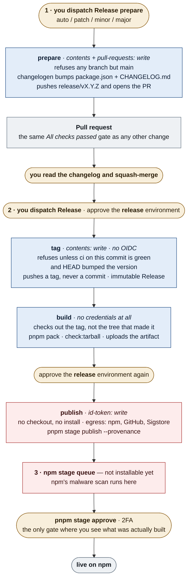

# Release

Releases run **entirely in CI**. There is no local release tooling, no `NPM_TOKEN`, and no
long-lived credential anywhere in this repository — publishing authenticates with OIDC against a
binding that only a job running from `main` in the `release` environment can satisfy.

It takes **two dispatches with a pull request between them**, and ends at a queue on npm that a
human has to approve with 2FA.

## The pipeline



Amber is a human, blue is a job holding a write credential, red is the privileged end of the
pipeline. **Five humans**, and the run stops at every one of them: the two dispatches, the merge,
the second environment approval, and the 2FA approval on npm — the only gate where you can inspect
what was actually built rather than trust that it was built correctly.

## Two dispatches, and why

**The release commit is a pull request like any other.** It is the one commit that decides what
the world installs, and until recently it was the only commit here that never passed through a
pull request or its checks — the release run bumped, committed and pushed it straight to `main`.
Now `Release prepare` opens a PR whose body is the changelog section it just wrote, so you read
what the GitHub Release will say before it exists, and the commit meets the same gate as
everything else.

That split is also what makes `main` protectable at all. A branch ruleset requiring a pull request
would have refused the old release job's push. Because nothing in the release writes to `main` any
more — `prepare` pushes to `release/vX.Y.Z`, `Release` pushes only a tag — the ruleset needs no bot
exemption.

**`Release` never bumps.** It reads the version out of the merged `package.json`. Running
`changelogen --release` in both halves would bump twice and tag `v0.1.1` for a `0.1.0` release.

**And it refuses a `HEAD` that did not change the version.** Without that, an ordinary PR merging
between the release PR and the dispatch takes the tag instead — and nothing downstream can tell,
because `build`'s tag↔manifest check compares the tag to `package.json`, which is unchanged, so it
still passes.

## Why three jobs

The credentials never meet the code:

| Job | Holds | Runs |
| --- | --- | --- |
| `tag` | `contents: write` — no OIDC | one `git tag`, then changelogen's GitHub Release step |
| `build` | nothing | the build, from a pristine checkout of the tag |
| `publish` | `id-token: write` — no checkout, no install | one pinned pnpm on one tarball, behind an egress allowlist |

`tag` is the only job that can write to the repository, and it writes exactly one thing: a tag, on
a commit already merged and already green. It holds no npm credential and cannot start until you
have approved the run. `build` executes dependency code with nothing worth stealing in reach.
`publish` holds the only credential that can reach npm and executes nothing but pnpm on a tarball,
with every network destination other than npm, GitHub and Sigstore blocked.

## One environment, two gates

`release` — required reviewer, `main` only — guards both jobs that can do damage. GitHub evaluates
environment protection per job, so it prompts twice in a run: once before `tag` writes anything to
the repository, and again after the build, before `publish` reaches npm. The second prompt is the
last cheap place to stop a release whose build looks wrong.

It is also what the npm Trusted Publisher is bound to. An OIDC token is accepted only from a job
that ran in `release`, and a job can run in `release` only from `main` — so a `release.yml` edited
on a scratch branch can neither write to the repository nor reach npm's queue.

## Stage before live

npm takes the release into a **stage queue**; it becomes installable only after you approve it
with 2FA, and npm's own malware scan has to finish before the approve button is enabled. This is
the one control that can stop a *poisoned build*: provenance proves where a package came from,
not what is in it. Rejecting a stage burns that version number — the tag is already immutable —
so fix forward with the next patch.

## Rehearsing

Check **dry-run** on **Release** to run everything except the writes. `build` packs and validates
`main` as it is, and `publish` performs the real OIDC exchange with npm and stops — so a rehearsal
proves the Trusted Publisher binding (repository, workflow filename, environment) end to end, and
fails if that exchange breaks.

The release-commit assertion downgrades to a warning in a dry run, so a rehearsal works on an
ordinary `main` rather than needing a prepared one. Do it after every change to `release.yml`.

## Cutting a release

1. **Actions** → **Release prepare** → **Run workflow** → choose the bump → **Run**.
   `auto` derives it from your Conventional Commits since the last tag.
2. Review the pull request it opens. The body is the changelog the GitHub Release will carry.
   Let `ci` pass, then **squash-merge** it.
3. **Actions** → **Release** → **Run workflow** → **Run**. It refuses if `ci` on that commit is
   not a completed success, or if `HEAD` is not the release commit.
4. Approve the `release` environment when asked — **twice**: once before `tag` writes the tag, and
   again before `publish` stages the package.
5. When the run is green, the tag, the GitHub Release and the staged package all exist. Approve
   the package:

   ```sh
   pnpm stage list nuxt-convex-module   # find the stage id
   pnpm stage view <stage-id>           # inspect what CI actually built
   pnpm stage approve <stage-id>        # 2FA — this is the moment it goes live
   ```

   `pnpm stage download <stage-id>` gets you the tarball itself if you want to diff it against the
   previous release. `pnpm stage reject <stage-id>` discards it — see *Stage before live* for what
   that costs.

6. Confirm the release carries provenance:

   ```sh
   npm view nuxt-convex-module@<version> dist   # lists an `attestations` key, not just `signatures`
   gh release verify v<version>                 # the GitHub Release attestation
   ```

## Recovery

- **Publish failed after the tag was pushed** (the GitHub Release exists, npm has nothing):
  re-run the failed jobs on that run (`gh run rerun <run-id> --failed`; the tarball artifact lives
  one day), or **Run workflow** again with `re-stage: vX.Y.Z` — it skips straight to staging that
  tag. Check `pnpm stage list nuxt-convex-module` first in case the first attempt did stage.
- **`ci` red, or `HEAD` is not the release commit** — the run refuses before writing anything.
  Nothing to undo.
- **Staged, then rejected** — the version is burned; fix forward.
- **"tag already exists" on push** — that version was already released; you dispatched twice.
- **The release PR was merged but never tagged** — dispatch `Release` on `main` while that commit
  is still `HEAD`. If something else merged first, the version assertion will refuse it; prepare a
  fresh release instead of tagging the wrong commit.

## Repository controls

Recorded so the guarantees are auditable. The rulesets themselves are committed under
[`.github/rulesets/`](./.github/rulesets/), and `weekly.yml`'s `rulesets` job fails if the live
rules stop matching them.

| Control | What it guarantees |
| --- | --- |
| `release` environment | Required reviewer; runs from `main` only. The Trusted Publisher's binding. |
| `main-guard` ruleset | `main` cannot be deleted or force-pushed. History can be added to, never rewritten. |
| `main-pr-gate` ruleset | `main` takes pull requests only, requires `All checks passed`, and requires signed commits. |
| `tag-guard` ruleset | `v*` tags can never be deleted, re-pointed or force-updated, so release history is permanently pinned to its commit. |
| Immutable releases | The Release changelogen creates locks its tag and carries an attestation: `gh release verify vX.Y.Z`. |
| `sha_pinning_required` | A workflow referencing a floating action tag is refused by GitHub itself, not only by zizmor. |
| Secret scanning + push protection, Dependabot alerts and security updates | On. |

**Why the release survives all of that.** `GITHUB_TOKEN` cannot bypass a ruleset — GitHub's bypass
list accepts repository roles, teams, GitHub Apps, org admins and Dependabot, and Actions is on
none of them. That used to be the binding constraint: requiring pull requests or signatures on
`main` would have blocked the release job's own push, and the alternative — a GitHub App key or a
PAT held as a secret — reintroduces exactly the long-lived credential this design exists to
remove.

Splitting the release dissolved the constraint rather than working around it. `prepare` pushes a
branch, `Release` pushes a tag, and neither touches `main` — so `main` can now demand pull
requests, checks and signatures, and the release is unaffected. The one rule still deliberately
absent is tag `creation`, because that would block CI from tagging at all; `tag-guard` freezes
tags once created instead.

## One-time setup (before the first OIDC release)

npm Trusted Publishing can only be configured **after** a package exists on the registry, so the
first version was published manually (`v0.0.0`).

1. **Configure the trusted publisher** at
   <https://www.npmjs.com/package/nuxt-convex-module/access> → **Trusted Publisher** →
   *GitHub Actions*:

   | Field               | Value                 |
   | ------------------- | --------------------- |
   | Organization / user | `qruto`               |
   | Repository          | `nuxt-convex-module`  |
   | Workflow filename   | `release.yml`         |
   | Environment         | `release`             |

   Leave it **stage-only** (the default). Enable **Require two-factor authentication and disallow
   tokens** — trusted publishers keep working (they authenticate with OIDC), and any leaked or
   stolen npm token becomes useless against this package. Use a passkey or hardware key as the
   second factor. Revoke any classic token you still hold locally once it is on.

2. **Install the [pkg.pr.new GitHub App](https://github.com/apps/pkg-pr-new)** on the
   repository so the `preview` workflow can publish continuous preview builds
   (`npm i https://pkg.pr.new/qruto/nuxt-convex-module@<sha>`). The same step
   ships `examples/playground` as a StackBlitz template via `--template`, which
   is what the **Open in StackBlitz** link in each PR comment opens. Drop that
   flag and pkg.pr.new silently substitutes a synthesised template that cannot
   run — see the comment in `preview.yml`.

## After the first publish

- **Submit to the [nuxt/modules](https://github.com/nuxt/modules) registry** (requires the
  package on npm): in a clone of that repo run
  `pnpm sync nuxt-convex-module qruto/nuxt-convex-module`, add an SVG icon under `icons/`, set
  `category` (Database) and `type: 3rd-party` in the generated
  `modules/nuxt-convex-module.yml`, point `website` at the docs site, and open a PR. npm
  stats, description, and maintainers auto-sync afterwards.
- **Add GitHub repo topics** for discoverability: `nuxt`, `nuxt-module`, `convex`, `vue`,
  `realtime`.
- The README's StackBlitz links (`examples/minimal`, `examples/playground`) start working as
  soon as the package is installable from npm — they import from GitHub, so they resolve
  `nuxt-convex-module` from the registry. The per-PR StackBlitz link is different and already
  works: pkg.pr.new rewrites that dependency to the commit's preview tarball, so it needs no
  npm release at all.

## Conventional Commits

With `release-type: auto`, the bump is derived from
[Conventional Commits](https://www.conventionalcommits.org/) since the previous tag:

| Commit type                          | Release |
| ------------------------------------ | ------- |
| `fix:`                               | patch   |
| `feat:`                              | minor   |
| `feat!:` / `BREAKING CHANGE:` footer | major   |

Other types (`chore:`, `docs:`, `refactor:`, `test:`, `ci:`, `build:`, `perf:`) appear grouped in
the changelog/release notes but do not force a bump. Below `1.0.0`, changelogen demotes one step:
a `feat` yields a patch and a breaking change yields a minor. To override the computed bump, pick
an explicit `patch` / `minor` / `major` when running the workflow.

## Dependencies

Dependency updates are automated by [Dependabot](./.github/dependabot.yml) — npm version
updates, GitHub Actions digest bumps (preserving the `@<sha> # vX.Y.Z` pinning convention), and
CVE security updates. No third-party app holds write access to the repo.

- **Monday schedule, grouped.** Non-major npm updates arrive as one grouped PR; Actions bumps
  as another. For major bumps Dependabot groups out, `pnpm bump` runs `taze major -w`.
- **Cooldown mirrors pnpm.** Dependabot's `cooldown` (2 days) is kept one day wider than pnpm's
  `minimumReleaseAge` (24 h, `pnpm-workspace.yaml`), so Dependabot never proposes a version pnpm
  refuses to resolve. Security updates skip the cooldown by design.
- **Keep the exclude lists in sync.** `cooldown.exclude` in `.github/dependabot.yml` must match
  `minimumReleaseAgeExclude` in `pnpm-workspace.yaml` (first-party Nuxt/Convex packages are
  waived), or Dependabot proposes versions pnpm won't install.
- **Inspected at PR time.** ci's `dependency-review` job fails any PR whose dependency delta
  introduces a known CVE (moderate or higher) or a package GitHub has flagged as malicious.
  pnpm's cooldown only *delays* a new version — it never looks at what's inside it.
- **Rescanned on a schedule.** `dependency-review` only sees what a PR changes, so
  [weekly.yml](./.github/workflows/weekly.yml)'s `osv` job scans the whole committed lockfile
  weekly — that, and Dependabot's own continuous re-evaluation, is what catches a CVE disclosed
  against a dependency that stopped changing.

## Checks outside ci

Everything that runs on a clock rather than on a commit lives in one file,
[weekly.yml](./.github/workflows/weekly.yml). None of it can block a merge — a scheduled check
that fails a pull request fails the wrong person at the wrong time. They exist to notice the world
moving underneath a repository that did not change:

| Job | What it watches |
| --- | --- |
| `scorecard` | drift in the repo's own posture — pinned actions, permissions, rulesets |
| `osv` | the committed lockfile, against the OSV database |
| `rulesets` | the live branch and tag rules, against the ones committed in `.github/rulesets/` |
| `links` | dead links in the docs, README and policy files — the one kind of rot no other gate sees |

CodeQL runs from GitHub's **default setup** (Settings → Code security), not from a workflow file
in this repository — on the `extended` query suite, over `javascript-typescript` and `actions`.

`ci`'s `static` job runs [zizmor](https://docs.zizmor.sh) over the workflows themselves; accepted
findings and their reasons live in [.github/zizmor.yml](./.github/zizmor.yml). Its correctness
counterpart is [actionlint](https://github.com/rhysd/actionlint), configured in
[.github/actionlint.yaml](./.github/actionlint.yaml).
